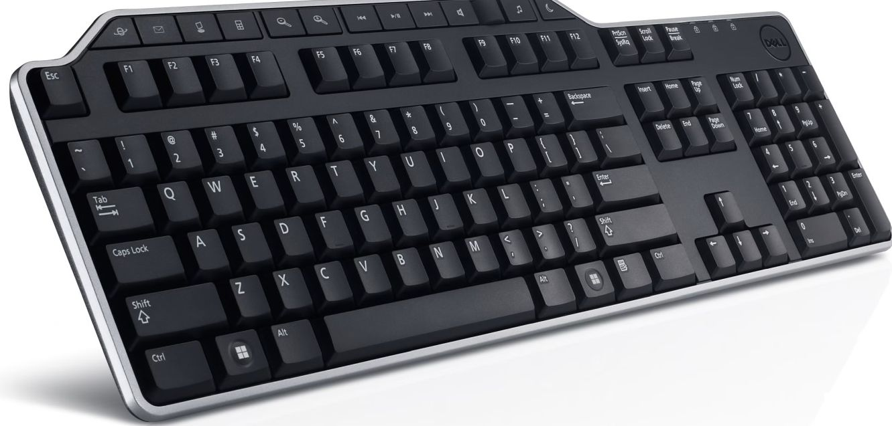

I like to run background music (usually it is something like [this on youtube][2]) while working on my computer. When an interruption comes, it is useful to be able to stop the play and resume it back later. 



Normally at my desk I have [Dell KB522][3] keyboard that features plenty of multimedia keys. The Play/Pause button works with youtube playing in Firefox just great. Only problem was when I am working outside my desk, since my laptop does not have those keys. But [it turn out][1] there is easy way to map those media keys to something available on that keyboard using [autohotkey][4] script:

```
^!Space::Send       {Media_Play_Pause}
^!Left::Send        {Media_Prev}
^!Right::Send       {Media_Next}
^!NumpadMult::Send  {Volume_Mute}
^!NumpadAdd::Send   {Volume_Up}
^!NumpadSub::Send   {Volume_Down}
```

Following mapping is created:

| Key                | Alternative   | Action      |
| ------------------ | ------------- | ----------- |
| Ctrl + Alt + Space | AltGr + Space | Pause       |
| Ctrl + Alt + Right | AltGr + Right | Next        |
| Ctrl + Alt + Left  | AltGr + Left  | Previous    |
| Ctrl + Alt + -     | AltGr + -     | Volume down |
| Ctrl + Alt + +     | AltGr + +     | Volume up   |
| Ctrl + Alt + *     | AltGr + *     | Mute        |

Similar mapping can be done for many other keys and also those media keys can be turned into something else. Key names are listed in [AHK documentation - List of Keys][5]. 

[1]: https://gist.github.com/mistic100/d3c0c1eb63fb7e4ee545
[2]: https://www.youtube.com/watch?v=YLTRozsCR1M
[3]: https://www.dell.com/en-us/shop/dell-business-multimedia-keyboard-kb522/apd/331-9653/pc-accessories
[4]: https://www.autohotkey.com/
[5]: https://www.autohotkey.com/docs/v1/KeyList.htm
