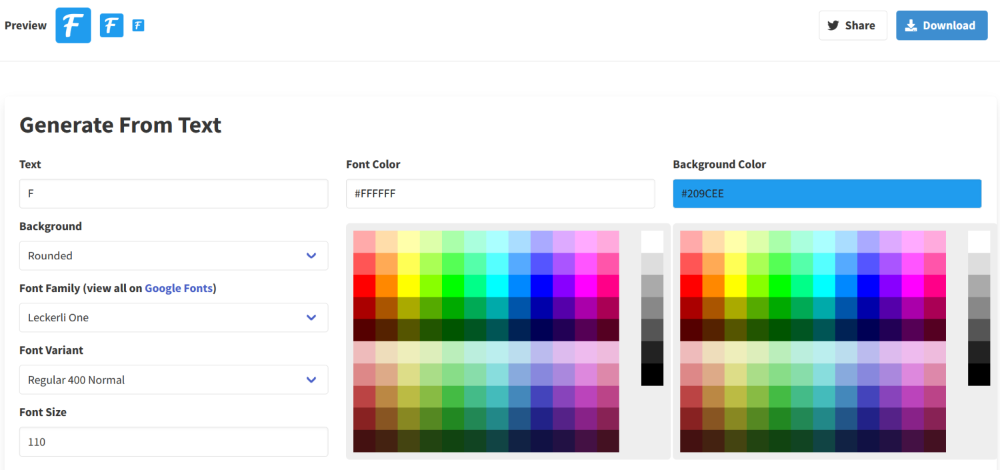

This site for quite long time lacked the favicon, making it more difficult to locate its pages in my browser. I was looking for something pretty simple that would create all sorts of sizes and would not need to spend too much time on.

After some googling I run across the [favicon.io](https://favicon.io/) and its [Text to Ico](https://favicon.io/favicon-generator/). You just need to pick

 - text (including Unicode characters)
 - shape (circle, rounded square, square)
 - font and its size
 - color and background color

Result can be seen on this site, it was done with about five minutes of work.
