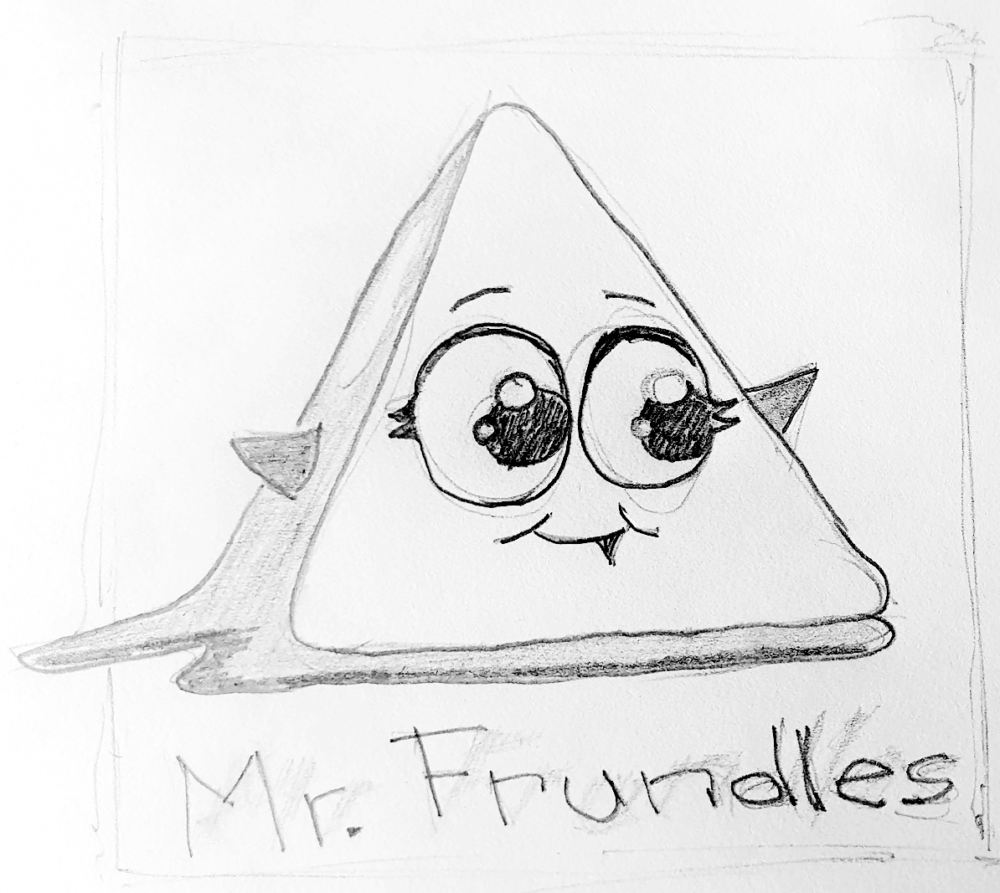

My son recently suggested that we should draw together. He asked me to draw [Mr. Frundles][1] creature from [Rick and Morty][2] animated series, which he enjoys. We spent some time together and while he worked on drawing his favorite Manga character, I created this:

I would like to improve my drawing, but usually have hard time to make myself to spend the time on this activity. Doing it together made it easier and maybe it is a way how to do it.

[1]: https://rickandmorty.fandom.com/wiki/Mr._Frundles
[2]: https://www.fandom.com/universe/rick-and-morty
