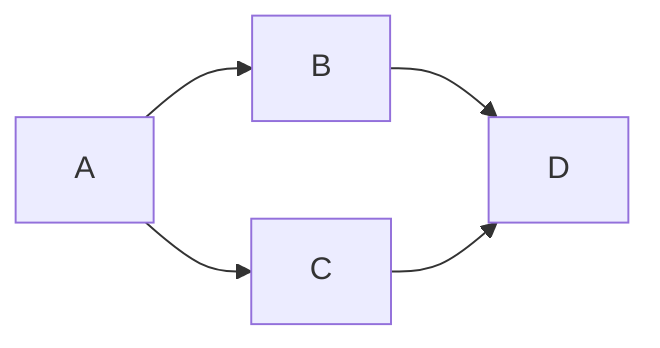
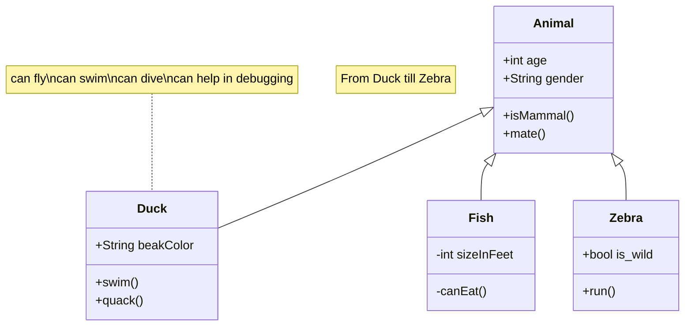
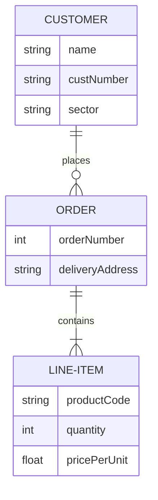
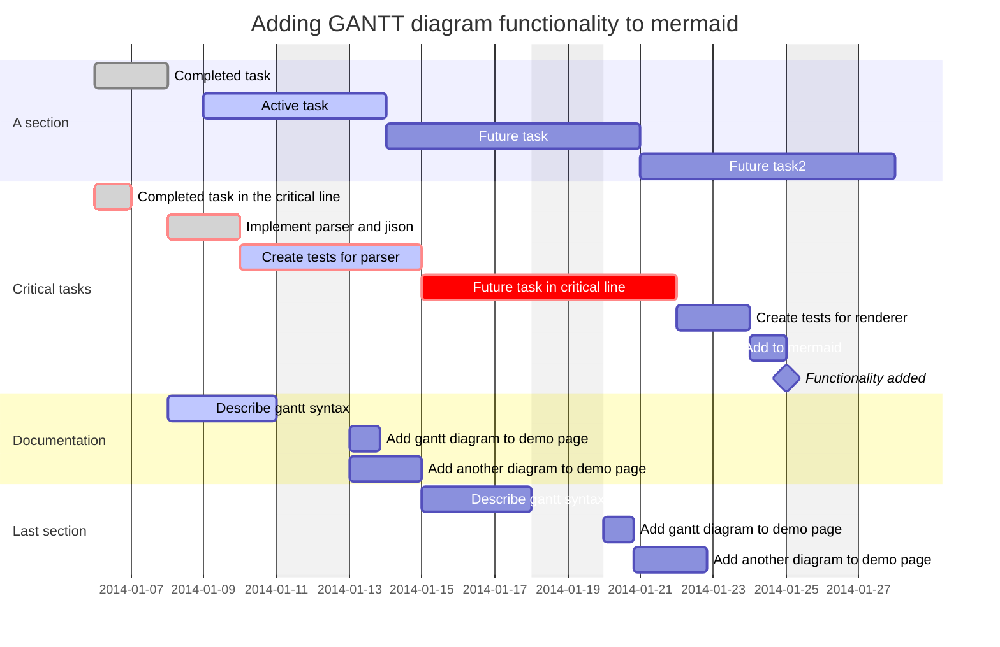
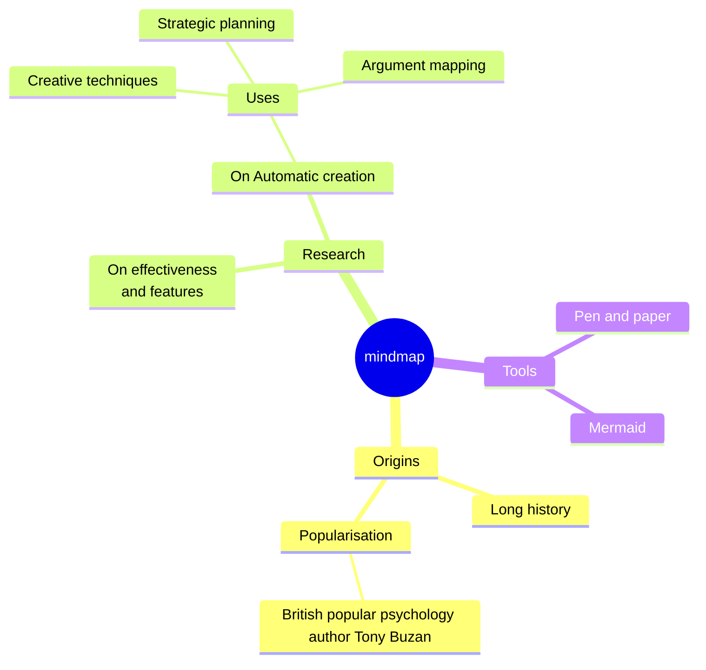
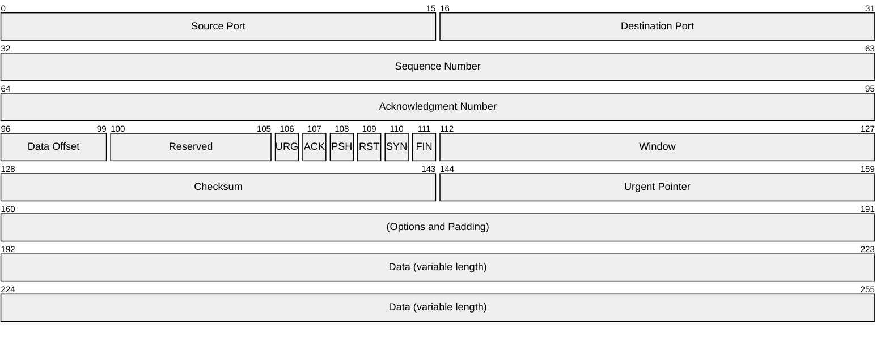

During my recent study of [Gitlab documentation on Markdown][1] I noticed it supports diagrams generated from a text. I am big fan of this approach and I've been using [graphviz][2] for similar tasks for years. Having it embedded in the readmes feels like another step in right direction for me.

First, this is how it looks like:

    ```mermaid
    graph LR;
        A-->B;
        A-->C;
        B-->D;
        C-->D;
    ```

When displayed by Gitlab, it looks like this without any extra effort:



I wanted something similar for this web, so I was looking on how to enable it in Github pages. It turns out, it is quite simple. In your main template just add the [Mermaid][3] CDN to your page `head` element and initialize it within a script after the page is loaded:

```html
<!doctype html>
<html lang=en>
<head>
  ...
  <script src=" https://cdn.jsdelivr.net/npm/mermaid@11.4.0/dist/mermaid.min.js "></script>
</head>
<body>
</body>
<script>
  mermaid.initialize({ theme: 'base' });
  mermaid_blocks = document.querySelectorAll('.language-mermaid')
  window.mermaid.init(undefined, mermaid_blocks);
  mermaid_blocks.forEach(mb => mb.parentElement.style.backgroundColor = 'transparent')
</script>
</html>
```

Last line is there because normally I have code block styled with dark background and do not want that for diagrams.

### Few examples of what Mermaid can do

Examples below are mostly copied over from [Mermaid docs][4]. The list is pretty impressive, here are just few things that I think will use in the future.

#### Class diagrams



#### Entity-relationship diagrams (ERD)



#### Gantt chart



#### Mindmap



#### Packet




[1]: https://docs.gitlab.com/ee/user/markdown.html
[2]: https://www.graphviz.org/
[3]: https://mermaid.js.org
[4]: https://mermaid.js.org/intro/